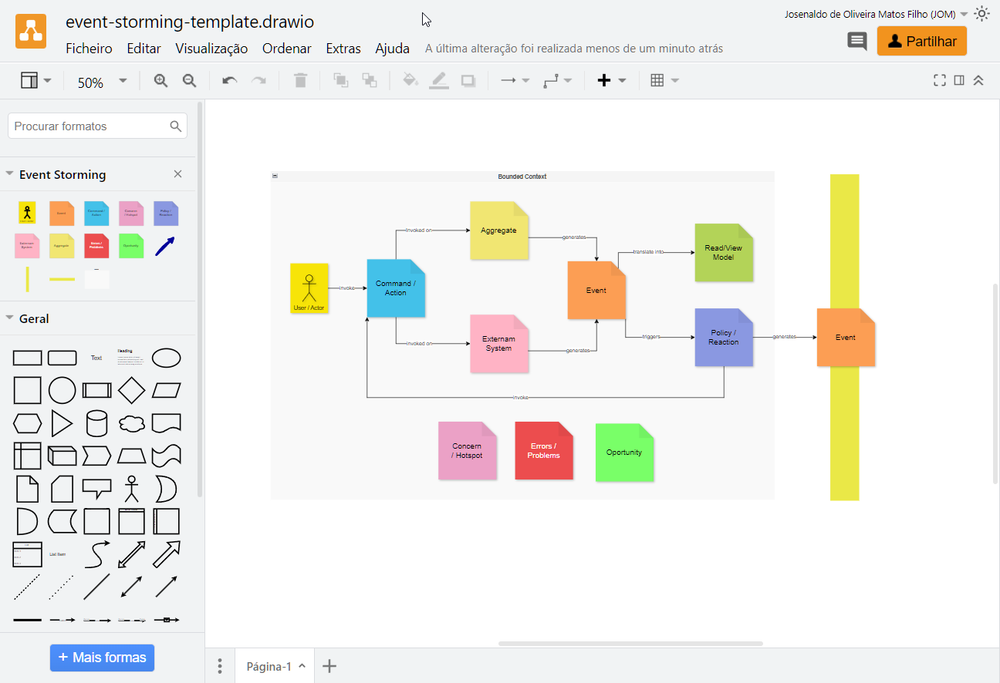

# Event Storming Template for Diagrams.net

This project provides a template for creating Event Storming diagrams on [Diagrams.net](https://app.diagrams.net/) (formerly known as Draw.io).

## About Event Storming

Event Storming is a rapid, intensive, and group-oriented modeling technique that promotes domain understanding. It's a collective learning and exploration technique that can be used at different stages of software development. For more information, please check [the oficial site](https://www.eventstorming.com/) and this fantastic repository, [Awesome EventStorming](https://github.com/mariuszgil/awesome-eventstorming).

## How to Use

1. Open the [Event Storming library](https://app.diagrams.net/?splash=0&clibs=Uhttps%3A%2F%2Fraw.githubusercontent.com%2Fjosenaldo%2Fevent-storming-template%2Fmain%2FEvent%20Storming.xml) in Diagrams.net.

  

2. Drag and drop the elements to the canvas.

## Contributing

Contributions are welcome! If you have suggestions for improvements, please open an issue for discussion or submit a Pull Request.

## License

This project is licensed under the MIT License - see the [LICENSE.md](LICENSE.md) file for details.

## Acknowledgments

- [Event Storming](https://www.eventstorming.com/)
- [Diagrams.net](https://app.diagrams.net/)

## Author

I'm always open to new opportunities and connections. If you'd like to get in touch, please feel free to reach out to me via any of the following channels:

  

  

  

  

